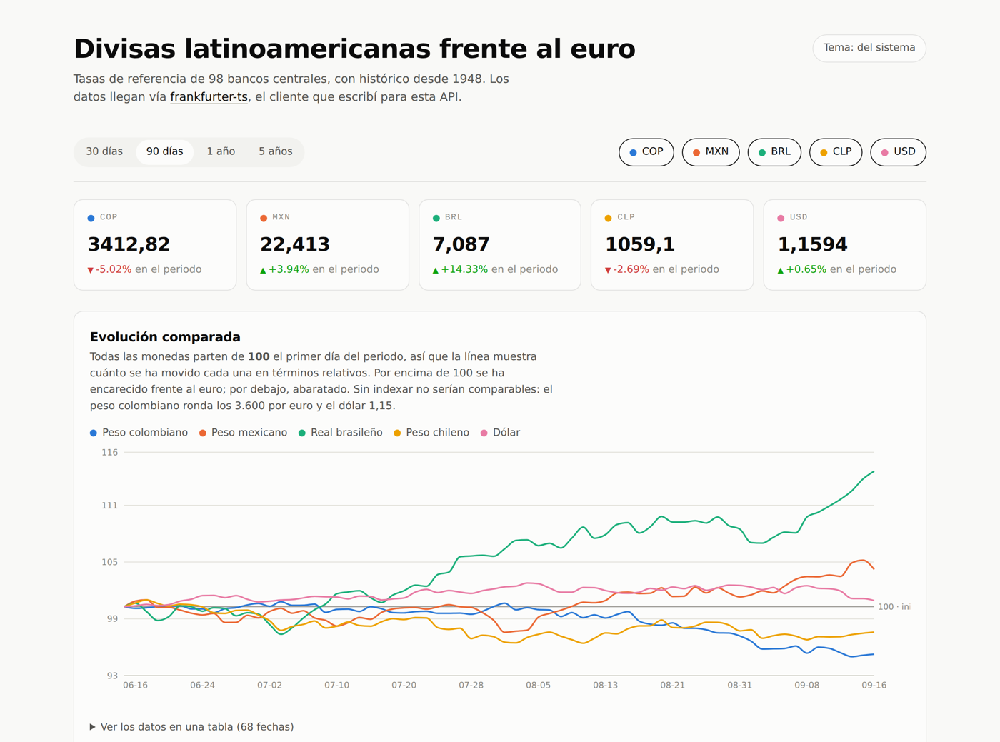

<div align="center">

# Panel de divisas latinoamericanas

**Cinco monedas con escalas incomparables, puestas en un solo eje para que la pregunta que responde el gráfico sea la interesante.**

[](https://github.com/danielbuitragoh/panel-divisas/actions/workflows/desplegar.yml)



[**Ver el panel**](https://danielbuitragoh.github.io/panel-divisas/) · [Código del cliente que lo alimenta](https://github.com/danielbuitragoh/frankfurter-ts)

</div>

---

## Qué es

Un panel web que sigue la evolución del peso colombiano, el peso mexicano, el real brasileño, el peso chileno y el dólar frente al euro, con tasas de referencia de bancos centrales y un conversor al cambio del día.

El problema real no es pintar cinco líneas, es que esas cinco líneas no son comparables. El peso colombiano ronda los 3.600 por euro y el dólar 1,15: en el mismo gráfico sin más, una línea aplasta a la otra y la pantalla no dice nada. Todo lo que hay aquí sale de resolver eso bien.

## Lo que más me interesa que se mire

**Nunca dos ejes Y.** Es la salida fácil y es *el* error clásico de los paneles. Dos escalas distintas en un mismo gráfico inventan una correlación que no está en los datos, porque la alineación entre ambas es arbitraria: mueves un eje y la "relación" cambia. Las cinco monedas van indexadas a base 100 el primer día del periodo, sobre un solo eje. Todas arrancan del mismo sitio y la pregunta pasa a ser la que el usuario tenía en la cabeza: cuál se ha movido más, en términos relativos. La línea de referencia en 100 es un `ReferenceLine` y no una serie falsa, para que lleve su propia etiqueta y no contamine el tooltip.

**Sin servidor, y esa decisión se midió antes de tomarla.** La API de Frankfurter tiene CORS abierto (`access-control-allow-origin: *`), así que el navegador la llama directamente y el proyecto se despliega como sitio estático. Eso elimina los arranques en frío de 30 a 60 segundos del alojamiento gratuito de backends, que apaga el servicio tras unos minutos de inactividad. Quien abre un enlace y ve una pantalla en blanco durante 45 segundos, cierra la pestaña: el proyecto más visual de un portafolio tiene que abrir instantáneo. La primera medición concluyó lo contrario, que CORS estaba cerrado, y era un falso negativo: `fetch` desde Node no manda cabecera `Origin`, y sin `Origin` el servidor no tiene motivo para responder `access-control-allow-origin`. De ahí sale la norma que aplico: una medición que decide la arquitectura se verifica dos veces, y desde el mismo entorno en el que va a correr el código.

**Los datos llegan por mi propio paquete.** El panel consume [`frankfurter-ts`](https://github.com/danielbuitragoh/frankfurter-ts), el cliente que publiqué para esta misma API. La caché que respeta el `Cache-Control` del servidor, los reintentos, el servir datos caducados cuando la API no responde y la aritmética de enteros del conversor vienen de ahí; aquí no se repite nada. Consumir la propia librería es la prueba de fuego de su diseño: si fuese incómoda, este repositorio estaría lleno de parches alrededor de ella.

**El único color de la pantalla es el de los datos.** La interfaz es monocroma a propósito. Cuando el cromo compite en color con las series, el lector deja de saber qué significa un color. Los cinco colores de serie no están elegidos a ojo: pasan un validador de separación bajo daltonismo, contraste y bandas de luminosidad, en modo claro y en modo oscuro. Y el color sigue a la entidad, no a su posición: si filtras y quitas el peso mexicano, el colombiano sigue siendo azul. Repintar las series supervivientes según su nuevo orden rompe lo único que el usuario ya había aprendido.

**La accesibilidad está verificada, no prometida.** La variación lleva flecha y signo además de color, porque si el color es el único portador del significado la tarjeta no dice nada a quien no distingue rojo de verde. Bajo cada gráfico hay una tabla con los mismos datos: un SVG es invisible para un lector de pantalla, que oye "gráfico" y nada más. El modo oscuro se elige valor a valor, no se invierte; bajar el brillo de una paleta clara produce tonos sucios y contrastes que no se han comprobado.

**La pantalla de error está diseñada porque va a salir.** El uptime medido de la API ronda el 86%. Con ese número, el fallo no es un caso excepcional que se despacha con un spinner infinito: es un estado normal de la aplicación, con su mensaje y su botón de reintentar. El mismo criterio aplica a los datos servidos desde caché caducada, que se avisan en pantalla en vez de pasar por frescos.

## Stack

React · TypeScript · Vite · Recharts · [`frankfurter-ts`](https://github.com/danielbuitragoh/frankfurter-ts)

Datos de [Frankfurter](https://frankfurter.dev), que los toma de bancos centrales y fuentes oficiales.

## Cómo correrlo

```bash
npm install
npm run dev
```

Para comprobar los tipos y generar el sitio estático:

```bash
npm run verificar
npm run build
```

## Licencia

MIT · [Daniel Buitrago](https://github.com/danielbuitragoh)
